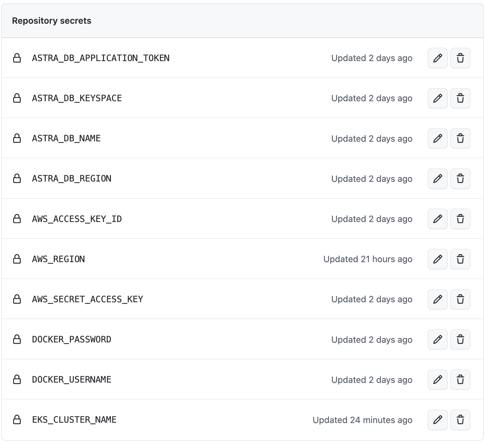

# astradb-devops-demo

This is to demo the automation of [Astra DB](https://astra.datastax.com) by using the [Astra CLI](https://github.com/datastax/astra-cli). This demo leverages [GitHub Actions](https://docs.github.com/en/actions) - a continuous integration and continuous delivery (CI/CD) platform. The demo application is based on [spring-music](https://github.com/cloudfoundry-samples/spring-music) and was adapted for Astra DB.

## Prerequisites
A Kubernetes cluster to run the application. A EKS cluster can be created on the command line like this. You need to have aws and eksctl commandline installed on your local machine.

```
eksctl create cluster \
--name df-cluster \
--version 1.23 \
--region eu-central-1 \
--nodegroup-name linux-nodes \
--node-type t2.medium \
--nodes 2
```
## Quickstart
- fork this repository
- create a [free astra db account](https://astra.datastax.com)
- select role 'Database Administrator' and generate an application token  
- download the credentials  
- Add Actions Secrets under settings in your forked repo. 

- clone this repo
```
git clone https://github.com/difli/spring-music-for-astradb.git
```
- cd in folder 'spring-music-for-astra-db'
```
cd spring-music-for-astra-db
```
- run application and inject [credentials](https://github.com/difli/spring-music-for-astradb/blob/main/src/main/resources/application.yml#L16-L19) to access your astra db instance via env variables.
```
./gradlew bootRun -Dastra_application_token='AstraCS:dPbn...' -Dastra_database_id=2e1df845-3796-4bbb-9d44-f5725abbcac2 -Dastra_database_region=europe-west1 -Dastra_keyspace=demo
```
- open a [browser window](http://localhost:8080) to access the application ui
