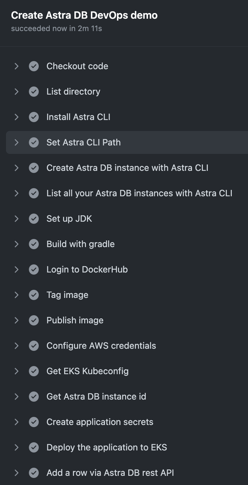
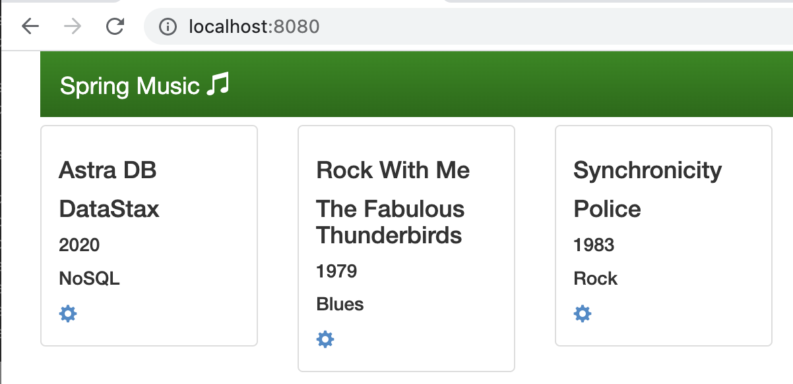

# astradb-devops-demo

This is to demo the automation of [Astra DB](https://astra.datastax.com) by using the [Astra CLI](https://github.com/datastax/astra-cli). This demo leverages [GitHub Actions](https://docs.github.com/en/actions) - a continuous integration and continuous delivery (CI/CD) platform. The DevOps pipeline creates a Astra DB instance, creates the application container image, pushes the container image to DockerHub, deploys the application to EKS and leverages the Astra DB rest API.

The demo application is based on [spring-music](https://github.com/cloudfoundry-samples/spring-music) and was adapted for Astra DB.

## Prerequisites
A Kubernetes cluster to run the application. A EKS cluster can be created on the command line like this. You need to have aws and eksctl commandline installed on your local machine.

```
eksctl create cluster \
--name df-cluster \
--version 1.23 \
--region eu-central-1 \
--nodegroup-name linux-nodes \
--node-type t2.medium \
--nodes 2
```
## Quickstart
- fork this repository
- create a [free astra db account](https://astra.datastax.com)
- select role 'Database Administrator' and generate an application token  
- download the credentials  
- Add secrets in GitHub Actions - "Actions Secrets" under settings in your forked repo. These secrets are referenced in the [pipeline definition](.github/workflows/demo-pipeline.yml)

- clone this repo
```
git clone https://github.com/difli/astradb-devops-demo.git
```
- cd in folder 'astradb-devops-demo'
```
cd astradb-devops-demo
```
- change the application code like for example the [title "Spring Music"](src/main/resources/static/index.html#L8) to something else.
- push your changes to the repository
```
git add . && git commit -m "XYZ" && git push
```
- This triggers the DevOps pipeline. The pipeline definition is [here](.github/workflows/demo-pipeline.yml)
- once the pipeline is finished, a new version of the application is online 
- Forward the port from your container to your local machine
```
kubectl port-forward svc/astradb-devops-demo 8080:8080
```
- open a [browser window](http://localhost:8080) to access the application ui

